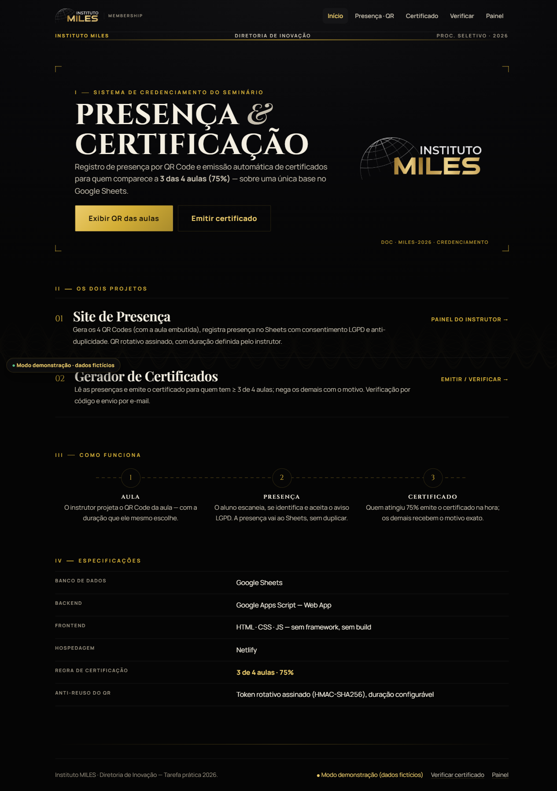
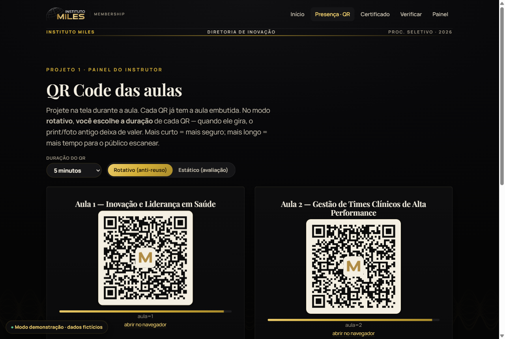
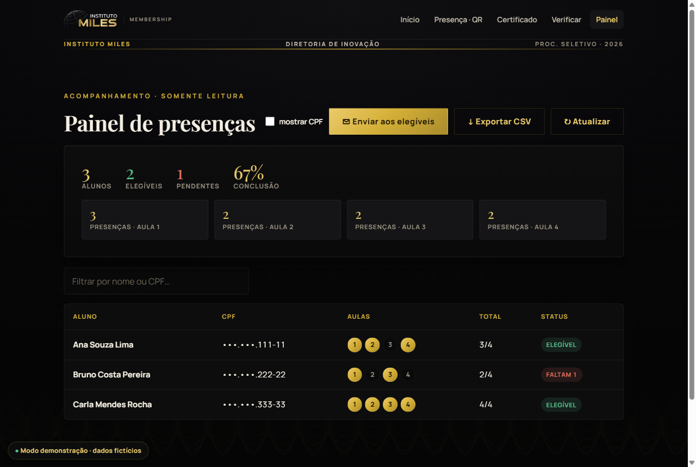
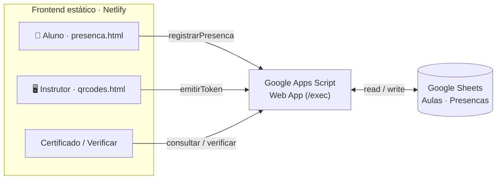

<h1 align="center">MILES · Presença por QR Code &amp; Gerador de Certificados</h1>

<p align="center">
  Tarefa prática — <b>Diretoria de Inovação · Instituto MILES 2026</b><br>
  Seminário de Inovação em Saúde — dois projetos integrados sobre uma base no Google Sheets.
</p>

<p align="center">
  <code>Google Sheets</code> · <code>Google Apps Script</code> · <code>HTML/CSS/JS</code> · <code>Netlify</code> · <code>identidade real do MILES</code>
</p>

<p align="center">
  
  
</p>
<p align="center">
  
  
</p>

---

> **▶️ Quer ver funcionando sem instalar nada?** O site tem **modo demonstração**: enquanto o
> backend não está configurado (ou com `DEMO: true`), ele roda **100% no navegador** com dados
> fictícios em memória. Abra qualquer página, emita o certificado da Carla (`333.333.333-33`),
> veja o Bruno ser negado (`222.222.222-22`) — **sem precisar de Google Sheets no ar.**

O **MILES** promove seminários com **4 aulas**. Para receber o certificado, o aluno precisa
comprovar presença em **pelo menos 3 das 4 aulas (75%)**. Este repositório entrega os dois projetos:

| | Projeto | O que faz |
|---|---|---|
| **01** | **Site de Presença (QR Code)** | Gera os 4 QR Codes (a aula vai embutida), o aluno se identifica (nome, CPF, e-mail) com **consentimento LGPD**, e a presença é gravada no Sheets — **sem duplicar** (mesmo CPF + mesma aula). Bônus: **QR rotativo assinado** que invalida print/reuso. |
| **02** | **Gerador de Certificados** | Lê as presenças; para quem tem **≥ 3 de 4**, emite o certificado com **nome e CPF preenchidos**; para os demais, **nega informando o motivo** (ex.: *"presença insuficiente: 2 de 4 aulas"*). Inclui **página de verificação de autenticidade** pelo código. |

Os dois compartilham **a mesma planilha** e **o mesmo backend** em Apps Script.

## 🏛 Arquitetura



Comunicação por `POST` com `Content-Type: text/plain` (evita o *preflight* CORS do Apps Script).
Mais detalhes em [`docs/ARQUITETURA.md`](docs/ARQUITETURA.md).

## 🗂 Estrutura

```
miles-presenca-certificados/
├── apps-script/         Backend (Google Apps Script) — cole no editor da planilha
│   ├── Codigo.gs        doGet/doPost, setup(), tokens HMAC, dedup, elegibilidade, verificação
│   └── appsscript.json  manifesto (fuso + acesso do App da Web)
├── site/                ← pasta publicada no Netlify (publish directory)
│   ├── index.html       landing + status do backend
│   ├── qrcodes.html     Projeto 1 — painel do instrutor (QRs rotativos)
│   ├── presenca.html    Projeto 1 — formulário do aluno (abre ao escanear)
│   ├── certificado.html Projeto 2 — verificação + emissão/negação
│   ├── verificar.html   Projeto 2 — autenticidade do certificado pelo código
│   ├── admin.html       painel (somente leitura) — métricas, CSV, CPF mascarado
│   ├── config.js        ÚNICO arquivo a editar (URL do Apps Script + modo demo)
│   └── assets/          styles.css · app.js · miles-logo.png · vendor/qrcode.min.js
└── docs/                ARQUITETURA · PLANILHA · DEPLOY · assets/ (prints)
```

## 🚀 Deploy (≈ 15 min)

> 📘 **Tutorial completo, passo a passo (com prints em texto e solução de problemas):**
> **[`docs/DEPLOY.md`](docs/DEPLOY.md)** — inclui como **tirar do modo demonstração**. Resumo abaixo:

### 1) Banco de dados — Google Sheets
Crie uma planilha em branco. (As abas são criadas sozinhas no passo seguinte.)

### 2) Backend — Google Apps Script
1. Na planilha: **Extensões → Apps Script**.
2. Cole o conteúdo de [`apps-script/Codigo.gs`](apps-script/Codigo.gs).
3. Selecione **`setup`** e clique **Executar** (autorize). Cria as abas `Aulas`/`Presencas`,
   semeia as 4 aulas (tema saúde) e gera o segredo HMAC.
4. **Recomendado para avaliação:** rode **`semearExemplos`** → insere 3 alunos fictícios.
5. **Implantar → Nova implantação → App da Web**: *Executar como:* **Eu** · *Quem acessa:* **Qualquer pessoa**.
6. Copie a **URL** (termina em `/exec`).

> Flags e ações em [`apps-script/README.md`](apps-script/README.md).

### 3) Frontend — conectar e publicar no Netlify
1. Edite [`site/config.js`](site/config.js) e cole a URL em `WEB_APP_URL`.
2. Suba o repositório no **GitHub** (público). Crie um repositório **vazio** (sem README,
   sem .gitignore, sem licença) e rode, **um comando por linha**:

```bash
git init
git add .
git commit -m "MILES — presenca por QR Code + gerador de certificados"
git branch -M main
git remote add origin https://github.com/SEU_USUARIO/miles-presenca-certificados.git
git push -u origin main
```

3. No **Netlify**: *Add new site → Import from GitHub* → **Publish directory:** `site` · Build command: *(vazio)*.
4. *(Alternativa sem Git)* arraste a pasta `site/` em **app.netlify.com/drop**.

> **Dica:** você pode publicar o site **antes** de configurar o backend — ele já abre em
> **modo demonstração**. Depois, ao colar o `WEB_APP_URL`, passa a gravar no Sheets de verdade.

## ✅ Como testar

> Pré-requisito: ter rodado `setup()` **e** `semearExemplos()` no Apps Script (ou usar o modo demo).

**Roteiro de avaliação em 2 minutos** (CPFs fictícios criados por `semearExemplos`):

1. **Presença** — `qrcodes.html` → escaneie um QR no celular **ou** (sem celular) clique em
   *"abrir no navegador"* embaixo de um QR no modo **Estático** → preencha e registre.
2. **Anti-duplicidade** — escaneie a **mesma** aula de novo → o sistema avisa que a presença **já existia**.
3. **Certificado — limite exato** — `certificado.html` com **`111.111.111-11`** (Ana, **3/4** → emite no limiar dos 75%).
4. **Certificado — negado** — **`222.222.222-22`** (Bruno, **2/4** → nega: *"presença insuficiente: 2 de 4 aulas"*).
5. **Certificado — completo** — **`333.333.333-33`** (Carla, **4/4** → emite).
6. **Autenticidade** — copie o **código** do rodapé do certificado em `verificar.html` → confirma nome e aulas.
7. **Painel** — `admin.html` → totais, **% de conclusão**, **presenças por aula**, **Exportar CSV** e CPF mascarado.

## 🔒 Anti-reuso do QR (bônus)
O QR exibido na aula carrega um **token assinado (HMAC-SHA256)**. O **instrutor escolhe a duração**
de cada QR no painel (30 s a 10 min — padrão **2 min**, bom para congresso); a **duração viaja
assinada dentro do token**, e o servidor a aceita por **~1–2× esse tempo**. Quando o QR gira, o
**print/foto** antigo deixa de valer — o meio-termo ideal entre "estático" (sem proteção) e "curto
demais para o público escanear". O segredo fica em *Script Properties* — nunca no frontend nem na
planilha. Comparação de tokens em tempo constante. Mais detalhes em [`docs/ARQUITETURA.md`](docs/ARQUITETURA.md).

## ✨ Além do pedido
- **Certificado por e-mail** — envio automático via Apps Script (`MailApp`): o aluno pede o seu, ou o admin envia a **todos os elegíveis** de uma vez.
- **QR com a marca** — o “M” do MILES no centro de cada QR (correção de erro nível H mantém a leitura).
- **Suíte de testes** — `runTests()` no Apps Script cobre token/dedup/elegibilidade/verificação (✓/✕ nos logs).
- **Modo demonstração** — site funciona sem backend (dados fictícios), com selo discreto e status no rodapé.
- **Verificação de certificado** — o código de verificação realmente valida (página `verificar.html`).
- **Painel que vira decisão** — % de conclusão, presenças por aula e **exportação CSV** dos elegíveis.
- **Privacidade by design** — CPF **mascarado no servidor**, minimização de dados, aviso LGPD com base legal/retenção/DPO, banner de "ambiente de avaliação".
- **Hardening** — CSP, HSTS, Permissions-Policy e `X-Frame-Options` no Netlify; lib de QR vendorizada (sem depender de CDN).
- **Acessibilidade** — foco visível por teclado, `aria-live`, rótulos, modal com Esc/foco, contraste AA.

## 🎨 Identidade visual — “Credencial Gravada”
Usa a **identidade real do Instituto MILES** (institutomiles.com.br): logo oficial (globo + wordmark),
dourado **#D4AF37 sobre preto** e a tipografia da marca — **Cinzel**, **Playfair Display** e **Manrope**.
Em vez da “landing dark + dourado” genérica, o site inteiro é tratado como um **documento de credencial
gravado**: superfície fosca (sem glow), **guilhochê de segurança** gerado por matemática (curvas
hipotrocoides) como marca d'água, cabeçalho de documento com numerais tabulares, capa emoldurada por
filetes e o **nome como herói** no certificado. Baixado via impressão nativa do navegador (“Salvar como PDF”).

## 🧰 Stack & decisões
Resumo técnico, modelo de dados e trade-offs em [`docs/ARQUITETURA.md`](docs/ARQUITETURA.md) e
[`docs/PLANILHA.md`](docs/PLANILHA.md). Passo a passo de publicação em [`docs/DEPLOY.md`](docs/DEPLOY.md).

## Licença
[MIT](LICENSE).
